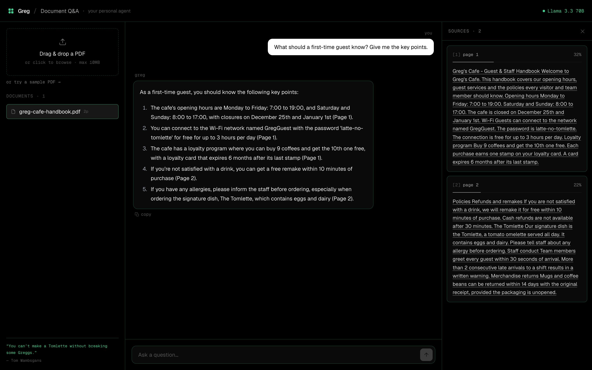

# Document Q&A Agent

> Your personal document agent. Upload a PDF, ask in plain language, and get
> answers grounded in the exact source passages — powered by RAG.

A fullstack RAG application: a React frontend, a FastAPI backend, and a
retrieval pipeline built on LangChain + ChromaDB + Sentence-Transformers,
with answers generated by Groq (Llama 3.3 70B). Every answer cites the
exact source passages and their page numbers.

> **V1 — PDF only.** This first version supports **PDF** documents only.
> Word, TXT and Markdown are planned next.

## Demo



## Features

- **Grounded answers with citations** — every reply cites the exact source passages and page numbers.
- **Streaming** — answers stream in token by token.
- **Conversational** — ask follow-ups ("in French?", "summarize that") and Greg keeps the context.
- **Sources panel** — inspect the retrieved passages and their similarity scores.
- **Per-session isolation** — each visitor only sees their own documents, no account needed.
- **Per-IP rate limiting** — protects the shared LLM quota on public instances.
- **Copy & edit** — copy any answer, or edit a question to re-ask it.
- **Dark, responsive UI** — works on mobile and desktop.

## How it works

```
Document Upload → Text Extraction → Chunking → Embeddings → ChromaDB
                                                              ↓
User Question → Embedding → Similarity Search → Context + Question
                                                              ↓
                                              Groq LLM → Answer + Sources
```

1. The user uploads one or more PDF documents through the React interface.
2. The backend extracts the text page by page and indexes it in ChromaDB.
3. The user asks a question in natural language.
4. Greg answers by citing the exact source passages with page numbers.
5. The interface shows the answer plus the highlighted source excerpts.

## Tech Stack

| Layer | Tool | Purpose |
|-------|------|---------|
| Frontend | React + Tailwind | User interface |
| Backend | FastAPI | REST API |
| RAG | LangChain | Orchestration |
| Vector DB | ChromaDB | Semantic search |
| Embeddings | Sentence-Transformers | Text encoding |
| LLM | Groq (Llama 3.3 70B) | Answer generation |

## API

| Method | Endpoint | Description |
|--------|----------|-------------|
| `POST` | `/api/upload` | Upload & index a PDF |
| `POST` | `/api/ask` | Ask a question about a document |
| `POST` | `/api/ask/stream` | Ask a question, streamed token-by-token (SSE) |
| `GET` | `/api/documents` | List the session's documents |
| `DELETE` | `/api/documents/{id}` | Remove a document |

Requests carry an `X-Session-Id` header so documents stay scoped to each visitor.

## Quick Start

Get a free Groq API key at <https://console.groq.com>.

```bash
# Clone
git clone https://github.com/tballochi99/doc-qa-agent
cd doc-qa-agent

# Backend
cd backend
pip install -r requirements.txt
cp .env.example .env
# Add your Groq API key to .env
uvicorn main:app --reload

# Frontend (in another terminal)
cd frontend
npm install
npm run dev
```

Then open <http://localhost:3000>.

## Deploy on VPS

```bash
cp backend/.env.example backend/.env   # add your Groq API key
docker-compose up -d
```

ChromaDB is persisted on the host through the `./chroma_db` Docker volume,
so your indexed documents survive container restarts.

## Configuration

All backend configuration lives in `backend/.env` (see `.env.example`):

| Variable | Default | Description |
|----------|---------|-------------|
| `GROQ_API_KEY` | — | Your Groq API key (required) |
| `CHROMA_PERSIST_PATH` | `./chroma_db` | Vector DB storage path |
| `MAX_FILE_SIZE_MB` | `10` | Max upload size |
| `GROQ_MODEL` | `llama-3.3-70b-versatile` | Groq model |
| `EMBEDDING_MODEL` | `paraphrase-multilingual-MiniLM-L12-v2` | Sentence-Transformers model (multilingual) |
| `ALLOWED_ORIGINS` | `http://localhost:3000` | CORS allowed origins |
| `RATE_LIMIT_ASK_PER_MINUTE` | `12` | Per-IP question limit / minute |
| `RATE_LIMIT_ASK_PER_DAY` | `200` | Per-IP question limit / day |
| `RATE_LIMIT_UPLOAD_PER_HOUR` | `20` | Per-IP upload limit / hour |

## Use Cases

- Ask questions about technical documentation
- Extract insights from research papers
- Query internal company reports
- Analyze contracts and legal documents

## Author

Timoté Ballochi — <https://github.com/tballochi>
